# Documentation of project16

1. I installed aws cli and configured aws

   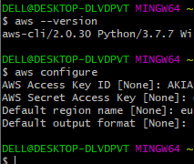

2. I created an s3 bucket

   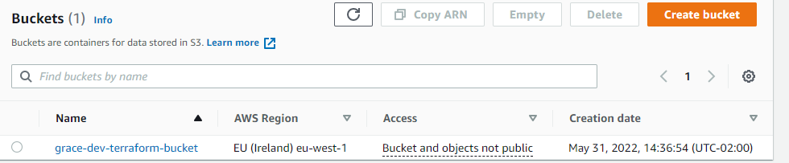
   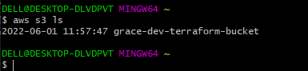

3. I created a folder and a file in VScode namely; "PBL" and "main.tf" respectively.
     
     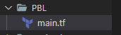

4. I installed and initialized terraform
     
     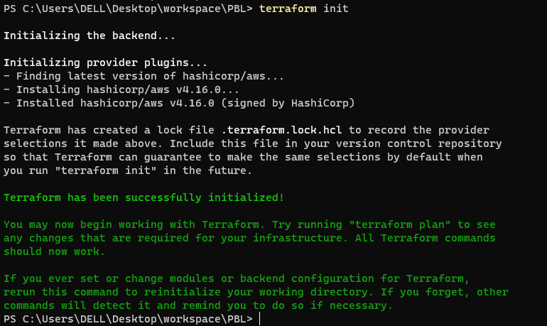

5. I added provider and resource to create VPC and subnet in the "main.tf" file
    
6. I saved it and ran "terraform plan" command
    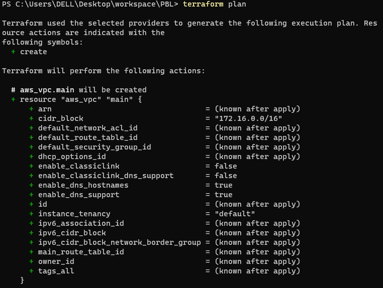

7. I ran `terraform fmt` and `terraform validate` to confirm
   
   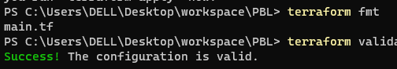

8. I ran `terraform plan` and `terraform apply` and it worked successfully

    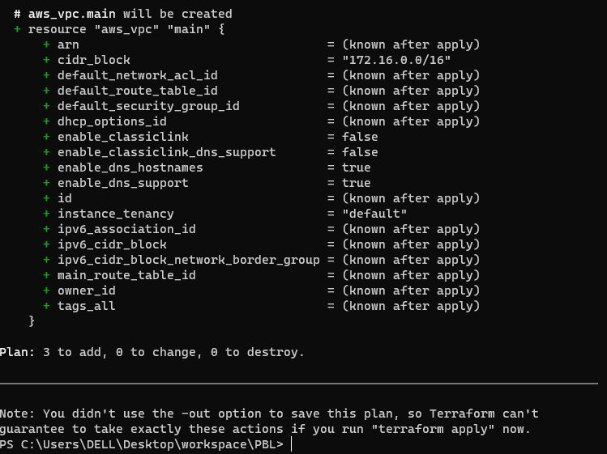
    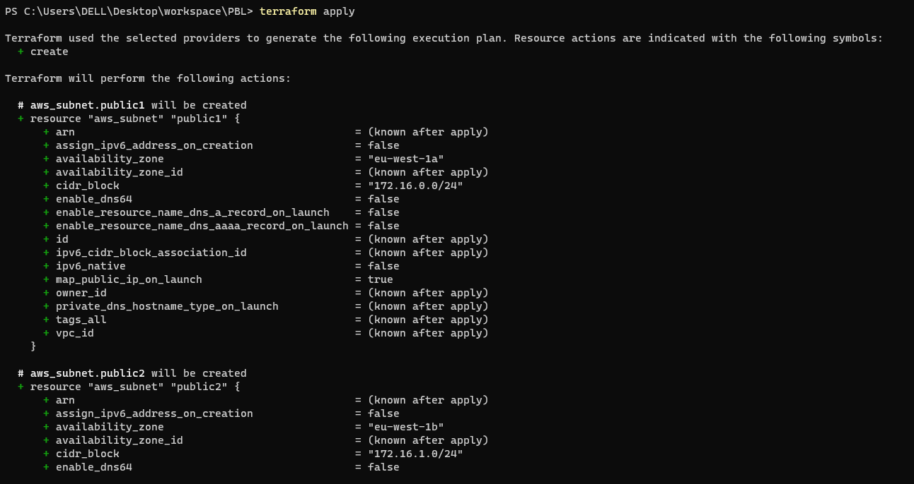
    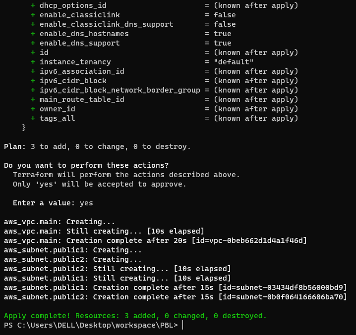

9. I checked my aws console to confirm if the VPC and the subnets has been created
   
   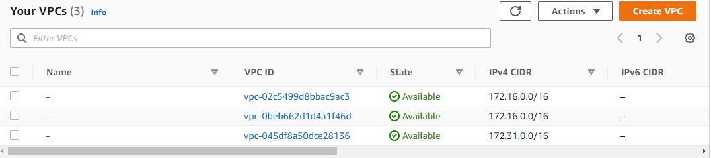
   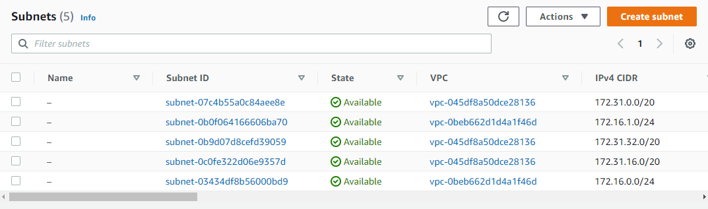

10. I destroyed what I created by running `terraform destroy`

    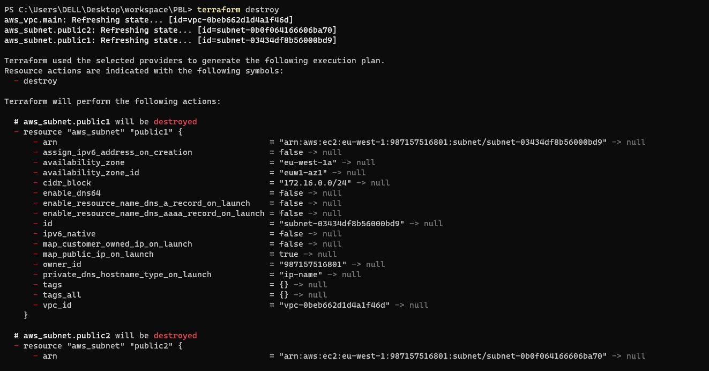
    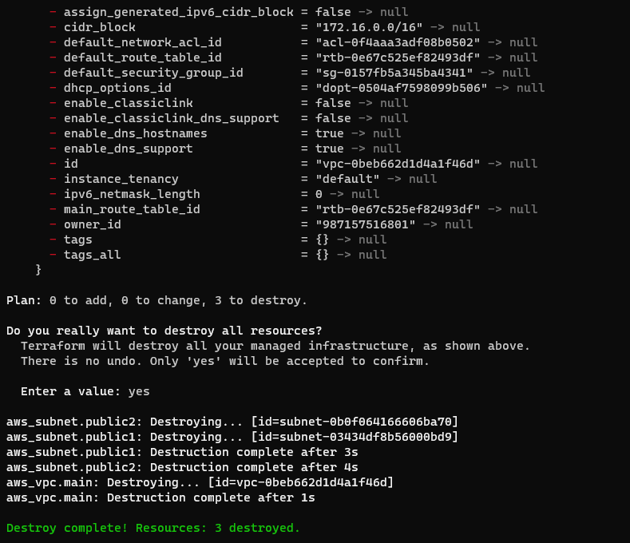

11. I checked my aws console to see if it has been destroyed
    
    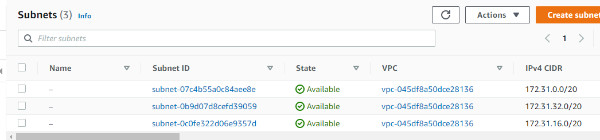
    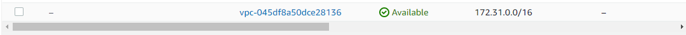

12. I entered my terraform console to check the cidrsubnet output
    
    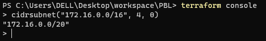
    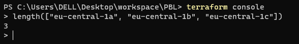

13. After changing some things and creating new files, I ran the `terraform plan`, `terraform fmt` and `terraform apply` commands
     
     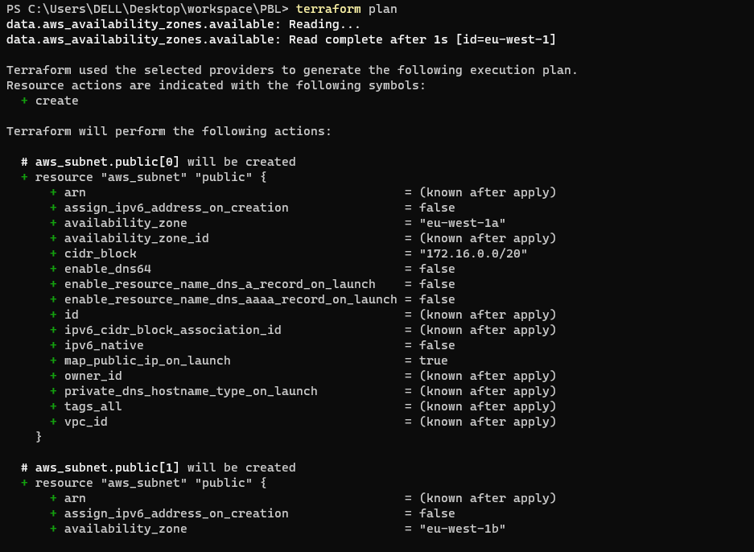
     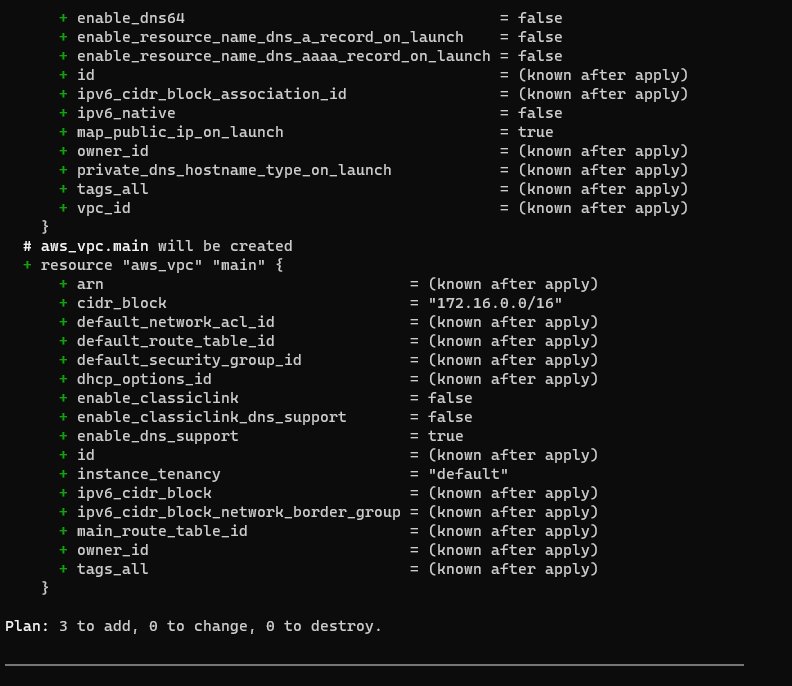
     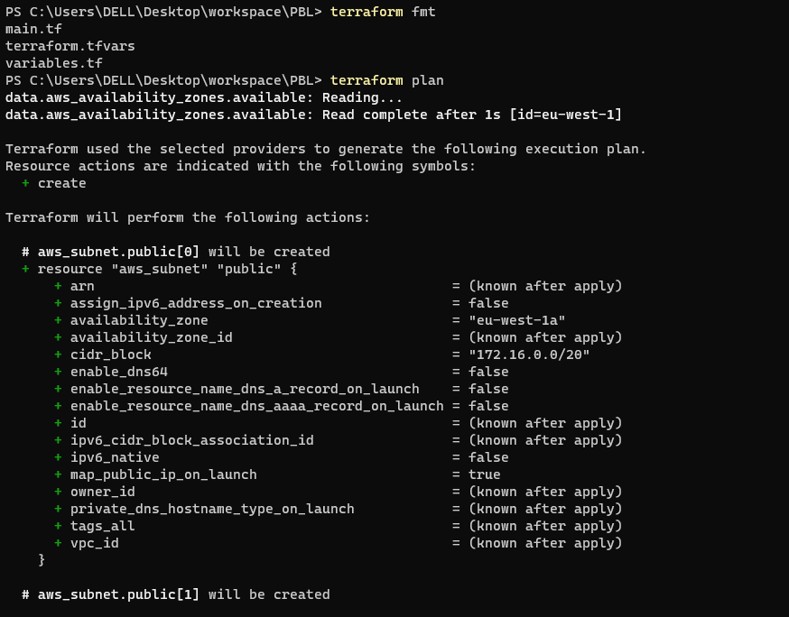
     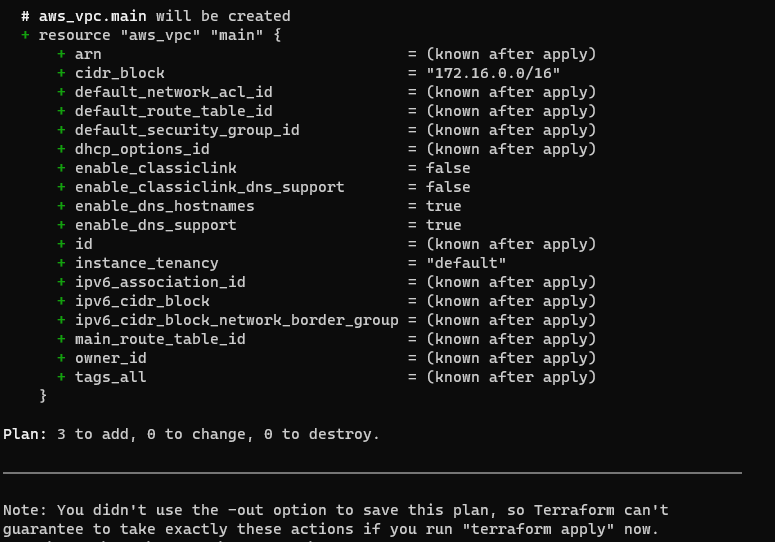
     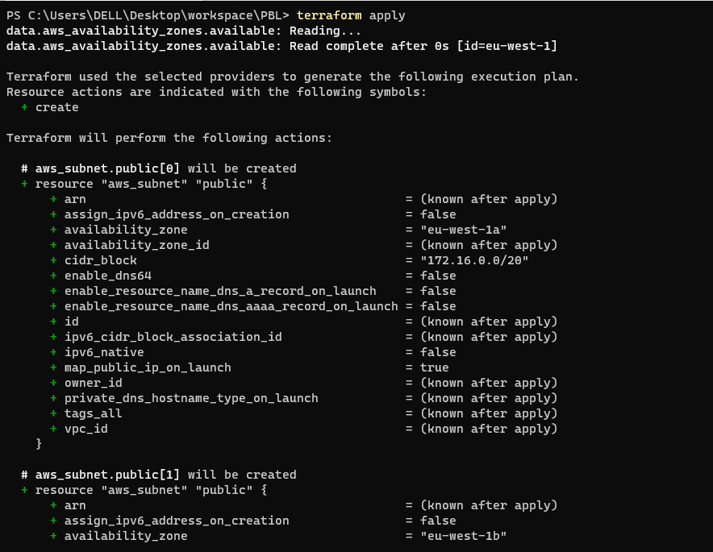
     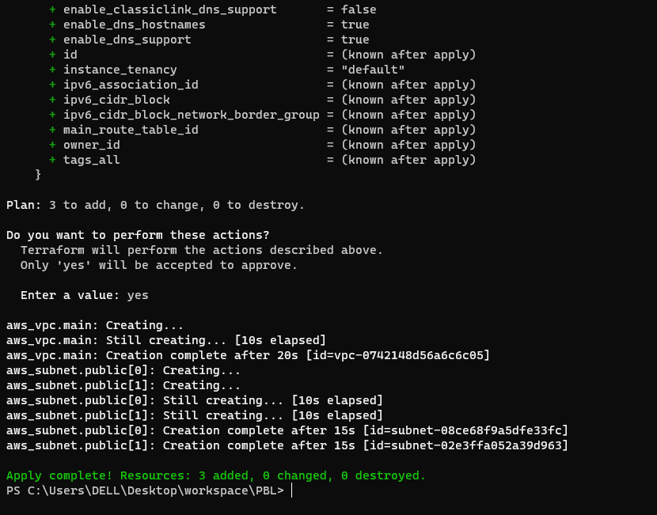

14. I checked my aws console to confirm if what I stated has been created

     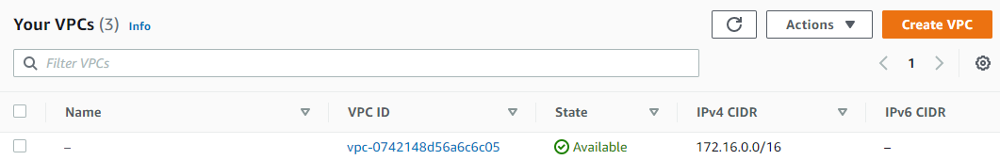
     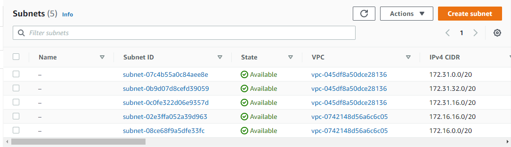

15. These are the snipped shots of my files
    
    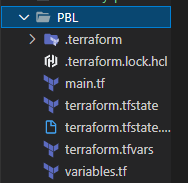
    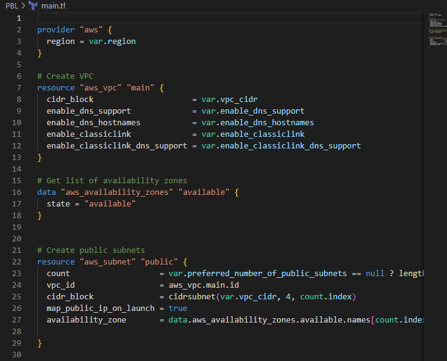
    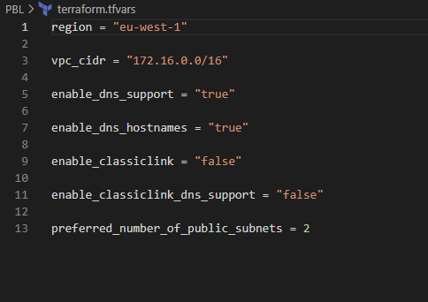
    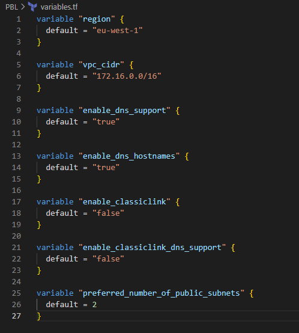
